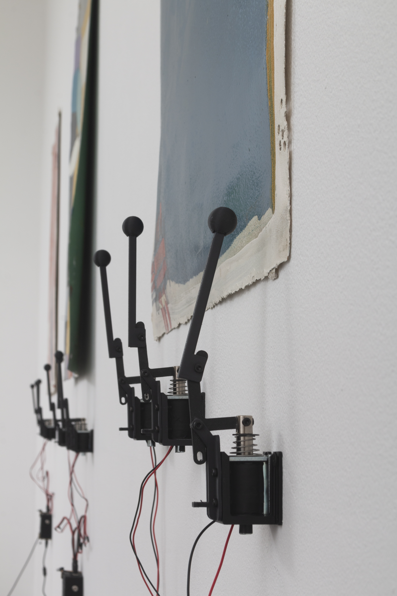

# MIDI Solenoid Player

## Project Overview
This project is a MIDI file player that controls solenoids to create physical sound or movement based on MIDI notes. It's designed to run on a microcontroller and can play MIDI files from multiple subdirectories in a specific order.

## Exhibition Information
This project is part of the ["»ensamble«"](https://carmenaraujoarte.com/exhibiciones_108_ensamble) exhibition at Carmen Araujo Arte gallery in Caracas, Venezuela:

- **Exhibition #108: »ensamble«**
- **Artists:** Armando Pantoja, Miguel La Corte, Pepe López
- **Dates:** October 19, 2024 - November 24, 2024
- **Location:** HLTPC. Secadero 2, Caracas

The exhibition brings together three artists from different disciplines creating a visual and sonic essay through rhythm. The installation features eighteen solenoids by musician Miguel La Corte distributed across a "tambor palitero" (traditional drum) crafted by drum maker Armando Pantoja and 6 paintings by visual artist Pepe López. Through this exercise, each rhythm reveals the understanding of the essential conditions that form time, proposing rhythm as a way to define and express time through culture.

## How It Works
1. The system boots up and looks for numbered subdirectories (1, 2, 3, etc.) in a `/midi_files` directory.
2. For each subdirectory, it selects a random MIDI file.
3. The selected MIDI file is loaded into memory.
4. The system waits until the next 5-second interval since boot time to ensure synchronized playback across multiple devices.
5. The MIDI file is played, controlling solenoids based on specific MIDI notes.
6. After playing a file, the system waits for 10 seconds before moving to the next subdirectory.
7. This process repeats for all subdirectories, then starts over.

## Hardware Requirements
- A microcontroller compatible with CircuitPython (e.g., Adafruit Feather, Raspberry Pi Pico)
- 4 solenoids connected to digital pins (D5, D6, D9, D10)
- Power supply suitable for your solenoids
- MicroSD card module (if your microcontroller doesn't have built-in storage)

## Software Requirements
- CircuitPython firmware installed on your microcontroller
- Required CircuitPython libraries: `digitalio`, `time`, `random`, `os`

## Setup Instructions
1. Install CircuitPython on your microcontroller if not already installed.
2. Copy the `code.py` file to the root directory of your microcontroller.
3. Create a `/midi_files` directory on your microcontroller.
4. Inside `/midi_files`, create numbered subdirectories (1, 2, 3, etc.).
5. Place MIDI files in these numbered subdirectories.
6. Connect your solenoids to the specified pins (D5, D6, D9, D10).
7. Power up your microcontroller.

## Customization
- Modify the `noid_pins` list to match your solenoid pin connections.
- Adjust the `notes` list to change which MIDI notes trigger the solenoids.
- Change the timing intervals in the main loop if needed.

## Troubleshooting
- Ensure all directories and files are named correctly.
- Check the console output for any error messages.
- Verify that your MIDI files are valid and not corrupted.

## Safety Note
Be cautious when working with solenoids and power supplies. Ensure proper wiring and use appropriate safety measures.

## License
This project is licensed under the MIT License - see the LICENSE file for details.

## Acknowledgments
- Based on original code by Liz Clark for Adafruit Industries
- MIDI file parsing adapted for CircuitPython

## Contact Information
For more information about the exhibition:
- Email: info@carmenaraujoarte.com
- Phone: +58 2129433979
- Address: Urb Sorokaima, Calle Rafael Rangel Sur
  Hacienda La Trinidad Parque Cultural Secadero 2
  CP 1080, Caracas, Venezuela
